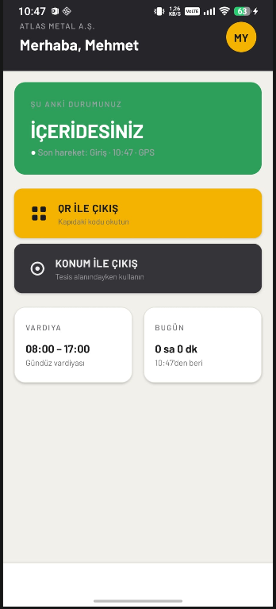
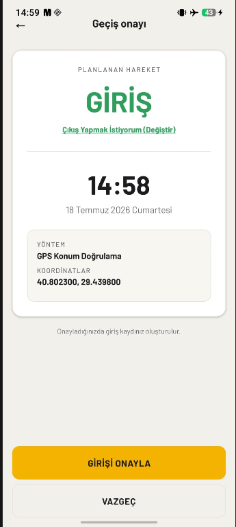
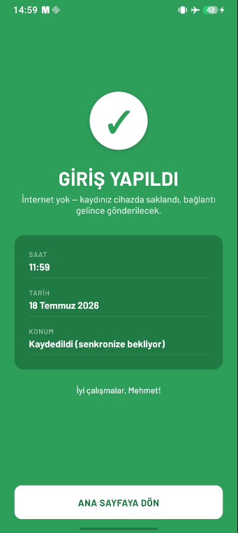
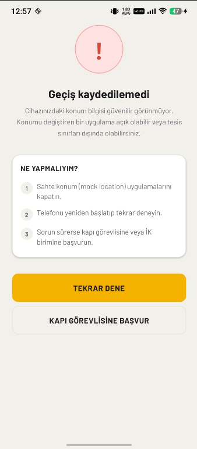

# PDKS Mobile — Personel Devam Kontrol Sistemi

Mobil cihaz üzerinden QR kod ve GPS doğrulamasıyla personel giriş-çıkış takibi sağlayan, sahtecilik önleme ve çevrimdışı çalışma destekli tam yığın (full-stack) PDKS çözümü.

> 🎓 Bu proje, Simple Software bünyesinde yürütülen zorunlu yaz stajı kapsamında geliştirilmiştir.
> **Geliştirici:** Halit ACET · **Teslim:** 11.09.2026

---

## Özellikler

- 🔐 **JWT tabanlı kimlik doğrulama** — firma kodu + kullanıcı adı + şifre, ilk girişte zorunlu şifre değişimi
- 📱 **Cihaz eşleştirme (device binding)** — hesap ilk giriş yapılan cihaza kilitlenir, farklı cihazdan erişim engellenir
- 📷 **QR kod ile geçiş** — kamera ile kapıdaki QR okutulur, eş zamanlı konum doğrulanır
- 📍 **GPS ile geçiş** — kamerasız, konum doğrulamalı giriş/çıkış
- 🛡️ **Çok katmanlı sahtecilik önleme**
  - Cihazda: sahte konum (mock location) tespiti
  - Sunucuda: imkânsız hız (ışınlanma), geofence ihlali, donmuş koordinat analizi
  - Şüpheli denemelerin ayrı tabloda loglanması
- ✈️ **Çevrimdışı çalışma** — internet yokken geçişler cihazda kuyruklanır, bağlantı gelince otomatik ve çift-kayıt korumalı (idempotent) senkronizasyon
- 🎨 **Endüstriyel tasarım dili** — saha koşullarına uygun yüksek kontrast, büyük dokunma alanları, Barlow tipografi

## Mimari

```text
+-----------------+          REST / JWT          +------------------+
|  React Native   | ---------------------------> |   Spring Boot    |
|  (TypeScript)   | <--------------------------- |    (Java 17)     |
|                 |                              |                  |
| - Keychain      |                              | - Spring Security|
| - Offline Queue |                              | - Fraud Detection|
| - Mock Detection|                              | - JPA/Hibernate  |
+-----------------+                              +--------+---------+
                                                          |
                                                    +-----v-----+
                                                    |   MSSQL   |
                                                    +-----------+
```

**Veritabanı tabloları:** `users` · `devices` · `locations` · `transactions` · `suspicious_attempts`

## Teknolojiler

| Katman | Teknoloji |
|---|---|
| Mobil | React Native 0.86, TypeScript, React Navigation, Axios |
| Güvenli depolama | react-native-keychain (JWT + cihaz kimliği) |
| Konum & Kamera | react-native-geolocation-service (FusedLocationProvider), react-native-vision-camera |
| Güvenlik | jail-monkey (mock/root tespiti), sunucu tarafı anomali analizi |
| Çevrimdışı | AsyncStorage kuyruğu + NetInfo bağlantı dinleyici |
| Backend | Java 17, Spring Boot 3.3, Spring Security 6, JWT (jjwt 0.12) |
| Veritabanı | Microsoft SQL Server, Spring Data JPA / Hibernate |

## API Uç Noktaları

| Metot | Yol | Açıklama |
|---|---|---|
| POST | `/auth/login` | Giriş + JWT üretimi + cihaz kontrolü |
| POST | `/auth/change-password` | İlk giriş zorunlu şifre değişimi |
| POST | `/device/register` | Cihaz eşleştirme |
| GET | `/device/verify` | Cihaz doğrulama |
| POST | `/admin/device-unbind` | Cihaz kaydını sıfırlama (ADMIN) |
| GET | `/transaction/next-action` | Sıradaki hareket önerisi (GİRİŞ/ÇIKIŞ) |
| POST | `/transaction/log` | Geçiş kaydı (sahtecilik kontrollü) |
| POST | `/transaction/sync` | Çevrimdışı kuyruk toplu senkronizasyonu (idempotent) |
| GET | `/transaction/history` | Sayfalı geçiş geçmişi |
| GET | `/health` | Sağlık kontrolü |

## Test Senaryoları (Kabul Kriterleri)

| # | Senaryo | Sonuç |
|---|---|---|
| TC01 | Farklı cihazdan giriş denemesi | ✅ "Bu hesap başka bir cihaza kayıtlıdır" — erişim engellendi |
| TC02 | Çevrimdışı geçiş + senkronizasyon | ✅ Kayıt cihazda saklandı, bağlantıda otomatik senkronize edildi |
| TC03 | GPS kapalıyken geçiş denemesi | ✅ Geçişe izin verilmedi, yönlendirici hata ekranı gösterildi |
| TC04 | Sahte konum (mock GPS) ile deneme | ✅ Cihazda tespit edildi, sunucu anomali katmanı ayrıca doğrulandı |

Ayrıntılı test kanıtları için: [`docs/test-report.md`](docs/test-report.md)

## Kurulum

### Backend

```bash
cd pdks-backend
# application.properties.example dosyasını application.properties olarak
# kopyalayıp DB şifresi ve JWT secret degerlerini girin
./mvnw spring-boot:run
```

### Mobil (Android)

```bash
cd PdksMobile
npm install
# src/config.ts icinde API_BASE_URL degerini backend makinesinin yerel IP adresine ayarlayin
npx react-native run-android
```

> **Gereksinimler:** JDK 17, Node 20+, Android SDK 34, MSSQL Server, fiziksel Android cihaz (GPS/kamera testleri için önerilir)

## Ekran Görüntüleri

| Ana Ekran | Geçiş Onayı | Başarı | Sahtecilik Engeli |
|---|---|---|---|
|  |  |  |  |

## Yol Haritası

- [x] Kimlik doğrulama + cihaz eşleştirme
- [x] QR / GPS geçiş çekirdeği
- [x] Sahtecilik önleme katmanları
- [x] Çevrimdışı senkronizasyon
- [ ] İK / Admin web paneli
- [ ] Dinamik (zaman bazlı) QR
- [ ] Vardiya tanımları ve puantaj raporları
