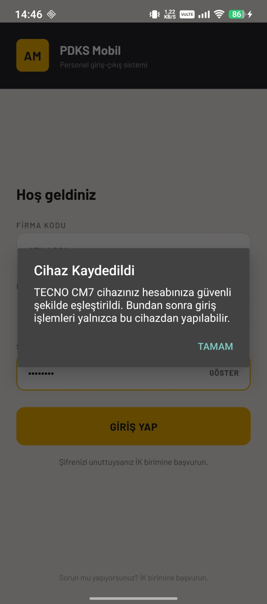
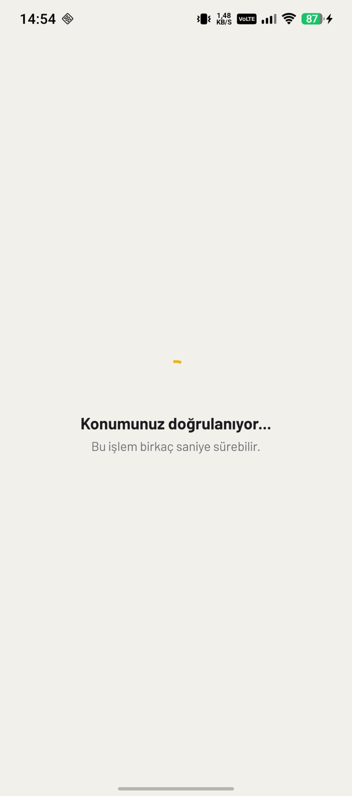

# PDKS Mobile — Test Raporu

**Proje:** Mobil Personel Geçiş Uygulaması
**Geliştirici:** Halit ACET
**Rapor Tarihi:** 20.07.2026
**Test Ortamı:** TECNO CM7 (Android), Windows 10 + SQL Server 2012 Express, Spring Boot 3.3 (lokal)

Bu rapor, proje dokümanında tanımlanan dört kabul senaryosunun (TC01–TC04) ve ek modüllerin test sonuçlarını içerir. Tüm testler gerçek Android cihaz üzerinde gerçekleştirilmiş, sunucu tarafı davranışları admin paneli üzerinden doğrulanmıştır.

---

## Kimlik Doğrulama

  
  

Yanlış şifre girişinde 401 hatası; ilk girişte zorunlu şifre değişimi ekranı canlı kural doğrulamasıyla (8 karakter, 1 rakam) çalışmaktadır.

---

## TC01 — Farklı Cihazdan Giriş Denemesi

| | |
|---|---|
| **Ön koşul** | Personel hesabı bir cihaza eşleştirilmiş durumda |
| **Adımlar** | 1. İlk girişte cihaz otomatik eşleştirilir 2. Hesap farklı bir cihazdan giriş yapmayı dener |
| **Beklenen** | Giriş engellenir, kullanıcı yönlendirici bir hata ekranı görür |
| **Gerçekleşen** | ✅ "Bu cihaz kayıtlı değil" ekranı gösterildi; İK'ya yönlendiren 3 adımlı açıklama sunuldu; giriş engellendi |

  
  

*Sol: ilk cihaz eşleştirme bilgilendirmesi · Sağ: farklı cihazdan giriş engeli*

---

## TC02 — Çevrimdışı Geçiş ve Senkronizasyon

| | |
|---|---|
| **Ön koşul** | Cihazda uçak modu açık (internet yok) |
| **Adımlar** | 1. Uçak modunda geçiş yapılır 2. Başarı ekranı görülür 3. Ana ekranda bekleyen kayıt rozeti kontrol edilir 4. Uçak modu kapatılır, otomatik senkronizasyon izlenir |
| **Beklenen** | Kayıt cihazda saklanır, bağlantı gelince otomatik iletilir, çift kayıt oluşmaz |
| **Gerçekleşen** | ✅ Başarı ekranı "kaydınız cihazda saklandı" mesajıyla gösterildi; ana ekranda senkron rozeti; Geçmiş'te BEKLİYOR etiketli kayıt; bağlantı gelince rozet kalktı, kayıt işlendi. Aynı kuyruğun tekrar gönderiminde çift kayıt oluşmadığı doğrulandı (idempotency) |

  
  
  
  

*Soldan sağa: çevrimdışı başarı → senkron rozeti → BEKLİYOR kaydı → senkronizasyon sonrası*

---

## TC03 — GPS Kapalıyken Geçiş Denemesi

| | |
|---|---|
| **Ön koşul** | Cihazda konum servisi kapalı |
| **Adımlar** | 1. Konum ile geçiş başlatılır |
| **Beklenen** | Konum alınamadığı için geçişe izin verilmez |
| **Gerçekleşen** | ✅ "Konumunuz alınamıyor" ekranı gösterildi; "Konum Ayarlarını Aç" yönlendirmesi sunuldu; geçiş kaydı oluşmadı |

  
  

*Sol: konum kapalıyken hata ekranı · Sağ: normal koşulda konum doğrulama akışı (karşılaştırma için)*

---

## TC04 — Sahte Konum (Mock GPS) Tespiti

| | |
|---|---|
| **Ön koşul** | Cihaza sahte GPS uygulaması kurulu, geliştirici seçeneklerinden mock location app olarak seçili, sahte yayın Google Haritalar'da doğrulanmış |
| **Adımlar** | 1. Sahte konum yayını başlatılır 2. Uygulamadan geçiş denenir 3. Sunucu tarafı katman ayrıca uzak koordinat/hız senaryolarıyla doğrulanır |
| **Beklenen** | Sahte konum tespit edilir, geçiş reddedilir; sunucu tarafı da bağımsız olarak şüpheli konumları reddeder |
| **Gerçekleşen** | ✅ Cihazda `position.mocked` bayrağı ile tespit edildi, sunucuya istek gitmeden "Geçiş kaydedilemedi" ekranı gösterildi. Sunucu tarafı savunma: imkânsız hız, geofence ihlali, donmuş koordinat ve mock bayrağı senaryolarının tümü reddedildi ve Şüpheli Denemeler'e loglandı |

  
  

*Sol: mobil red ekranı · Sağ: sunucu tarafı şüpheli deneme kayıtları (İmkânsız Hız / Tesis Dışı rozetleriyle)*

---

## Geçiş Çekirdeği ve Genel Akış

  
  
  
  

  
  
  

Ana ekran duruma göre dinamik kart ve buton etiketleri gösterir (dışarıda/içeride), gerçek vardiya bilgisini ve o günkü çalışma süresini içerir. QR tarama ekranında konum doğrulaması arka planda yapılır. Onay ekranında sunucunun önerdiği hareket tipi değiştirilebilir. Profil ekranı, personelin kendi aylık puantaj özetini ("BU AY" kartı) ve kayıtlı cihaz bilgisini gösterir.

---

## Admin Panel

  

  
  

  
  

Dashboard günlük özet istatistikleri ve son hareketleri gösterir. Personel sayfasından yeni personel eklenir, vardiya atanır, hesap pasife alınabilir. Cihazlar sayfasından İK, gerektiğinde cihaz eşleşmesini sıfırlayabilir. Geçiş Kayıtları filtrelenebilir ve CSV olarak dışa aktarılabilir. Lokasyonlar sayfasından yeni tesis/kapı tanımlanır ve o lokasyon için QR kod üretilip yazdırılabilir — **üretilen QR mobil uygulamayla okutularak uçtan uca döngü doğrulanmıştır.**

---

## Vardiya ve Puantaj

  
  

  
  
  

Vardiya tanımları (gece vardiyası dahil) oluşturulup personele atanabilir. Puantaj sayfası ay bazlı çalışma süresini hesaplar: tam gün (8s 0dk / TAM), geç kalma (dakika bazlı), eksik kayıt ve hafta sonu mesaisi ayrı durumlarla gösterilir; mola süresi otomatik düşülür. Eksik kayıtlar yalnızca zorunlu gerekçeyle düzeltilebilir. Kayıt silme işlemleri de gerekçe zorunluluğuyla yapılır ve `deleted_transaction_logs` tablosuna (kim/ne zaman/neden) denetim izi olarak yazılır. Puantaj ve geçiş kayıtları Excel uyumlu (UTF-8 BOM, Türkçe karakterli) CSV olarak dışa aktarılabilir.

---

## Karşılaşılan Sorunlar ve Çözümleri

### 1. SQL Server 2012 – Modern Java TLS Uyumsuzluğu
**Sorun:** SQL Server 2012 yalnızca TLS 1.0 konuşurken modern JDK güvenlik politikası TLS 1.0'ı devre dışı bırakıyor; bağlantı kurulamadı.
**Çözüm:** JDBC sürücüsü uyumlu sürüme sabitlendi, lokal geliştirme için TLS override tanımlandı. Üretimde güncel SQL Server ile bu geçici çözüme gerek kalmayacağı not edildi.

### 2. Mock Konum Tespitinin Çalışmaması (Konum API Katmanı)
**Sorun:** Sahte GPS aktifken uygulama konumu hiç alamıyor, mock tespiti tetiklenmiyordu.
**Teşhis:** Kullanılan kütüphane Android'in eski LocationManager API'sini dinliyordu; sahte GPS uygulamaları modern FusedLocationProvider'ı besliyor — iki katman birbirini görmüyordu.
**Çözüm:** FusedLocationProvider tabanlı `react-native-geolocation-service` kütüphanesine geçildi, `position.mocked` bayrağıyla tespit sağlandı. Test aracının niteliğinin de kritik olduğu görüldü: sürekli yayın yapmayan sahte GPS uygulaması timeout'a yol açarken, sürekli yayın yapan araçla tespit anında çalıştı.

### 3. Puantaj Motorunda Hesap Hataları
**Sorun:** Hafta sonuna mesai beklentisi yazılması; hafta sonu mesaisinden mola düşülmesi; çift GİRİŞ'te ilk giriş saatinin üst yazılması.
**Çözüm:** Hafta sonu beklenen süre 0 + `WEEKEND_WORK` durumu; hafta sonu mola düşümü kaldırıldı; çift eşleştirme, eşleşen tüm çiftleri toplayıp eşleşmeyenleri anomali olarak işaretleyecek şekilde düzeltildi.

### 4. Ağ Erişimi (Fiziksel Cihaz – Lokal Backend)
**Sorun:** Telefon tarayıcıdan backend'e ulaşırken uygulama "Sunucuya bağlanılamadı" veriyordu.
**Çözüm:** Android 9+ cleartext (HTTP) kısıtı için `network_security_config` tanımlandı, güvenlik duvarında 8080 portu açıldı.

---

## Bilinen Sınırlamalar ve Üretim Notları

- **iOS:** Derleme macOS/Xcode gerektirdiğinden bu stajda kapsam dışıdır (işveren onayıyla). Kod tabanı iOS uyumludur; iOS'ta resmi mock-konum API'si bulunmadığından TC04 sunucu tarafı anomali katmanıyla karşılanacak şekilde tasarlanmıştır.
- **Huawei (HMS):** GMS bulunmayan cihazlar HMS Location Kit entegrasyonu gerektirir; kapsam dışıdır (işveren onayıyla).
- **QR:** Mevcut QR'lar statiktir; zamanla değişen dinamik QR yol haritasındadır.
- **Kayıt silme:** Gerekçe zorunludur ve denetim loguna yazılır; üretim için tam soft-delete önerilir.
- **Bordro:** Sistem bilinçli olarak bordro/maaş hesabına girmez; puantaj CSV çıktısı bordro yazılımına/mali müşavire veri sağlar.
